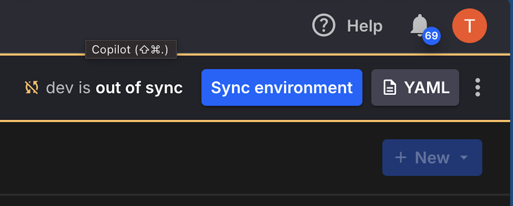
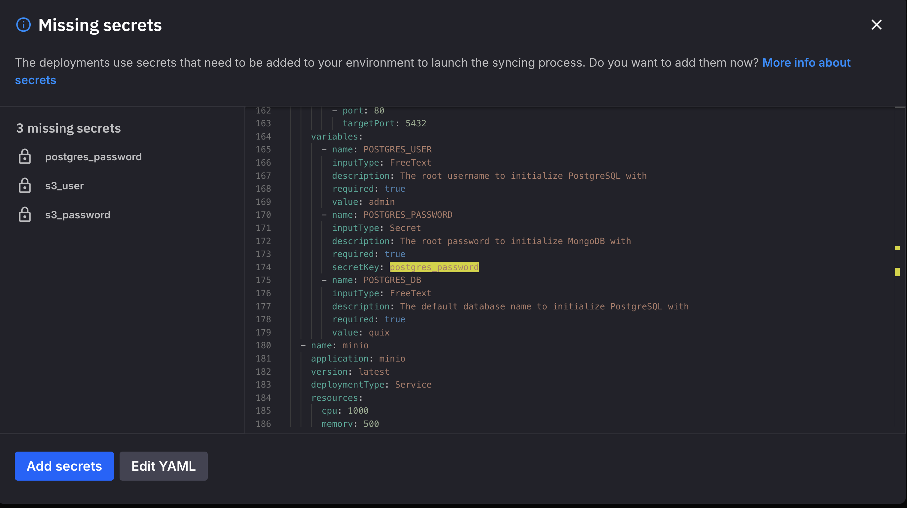
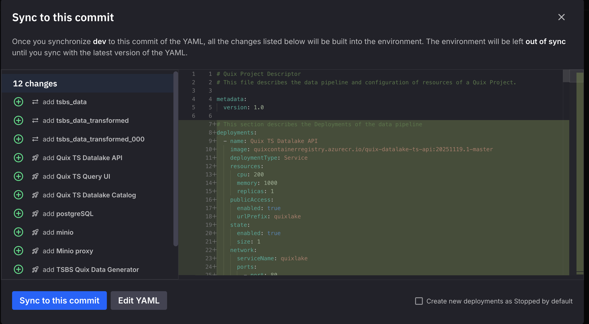
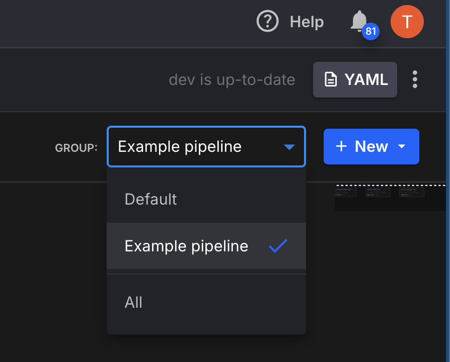

# QuixLake Initial Setup Guide

> **Note:** This setup guide is for the experimental QuixLake v2 Timeseries Preview. Configuration options may change before final platform integration.

This guide walks you through the initial configuration of the QuixLake template, including setting up secrets and configuring storage.

## Step 1: Configure Secrets

The template requires several secrets to be configured in your Quix environment. Quix manages secrets automatically during the synchronization process.

For more details on secrets management, see the [Quix Secrets Management documentation](https://quix.io/docs/deploy/secrets-management.html).

### Synchronization Flow

1. **Press the Sync button** in the top right corner of the Quix UI

   

2. **Quix will prompt you to add secrets** - enter values for any missing secrets

   

3. **Deploy the pipeline** - Quix will deploy all services with your configured secrets

   

### Required Secrets

| Secret Key | Used By | Description |
|------------|---------|-------------|
| `postgres_password` | PostgreSQL, Catalog | Password for PostgreSQL database |
| `config_ui_auth_token` | Sink, API | Auth token for catalog and API access |

### Setting Up Secrets

#### PostgreSQL Password (`postgres_password`)

PostgreSQL is used as the metadata backend for the Iceberg Catalog. Since it's deployed fresh:

1. **Choose a strong password** for `postgres_password`

This password will be used to:
- Initialize the PostgreSQL database
- Allow the Catalog service to connect to PostgreSQL

> **Important:** Store these credentials securely. Once set, you cannot retrieve them from Quix - you can only overwrite them with new values. If you lose these credentials, you'll need to reset them and potentially lose access to existing data.

### Example Secret Configuration

```
postgres_password: MySecureP@ssw0rd!2024
config_ui_auth_token: <your-auth-token>
```

## Step 2: Verify Deployment

After the synchronization completes, verify all services are running:

1. **Check Deployment Status** - Ensure all services start successfully:
   - PostgreSQL
   - Quix TS Datalake Catalog
   - Quix TS Datalake API
   - Quix TS Query UI

2. **Verify Storage** - Check deployment logs for services with `blobStorage: bind: true` to confirm blob storage credentials are injected

## Step 3: Run the Example Pipeline (Optional)

To test your setup with sample data, you first need to switch to the "Example pipeline" group in the pipeline view:



Then:

1. Start the **TSBS Data Generator** job to produce sample time-series data
2. The **TSBS Transformer** and **Quix TS Datalake Sink** services will process and store the data
3. Open the **Query UI** (Data Explorer) to run queries:
   ```sql
   SELECT * FROM sensordata LIMIT 10;
   ```

---

## Blob Storage

Storage is managed automatically by the Quix platform. Services with `blobStorage: bind: true` in their `app.yaml` or `quix.yaml` configuration receive blob storage credentials via the `Quix__BlobStorage__Connection__Json` environment variable at runtime. The `quixportal` library handles parsing these credentials and providing a unified filesystem interface across providers (AWS S3, Azure Blob Storage, GCP Cloud Storage).

No manual storage configuration is needed — the platform handles it.

---

## Troubleshooting

### Services failing to start
- Verify all secrets are configured correctly
- Check that secret names match exactly (`postgres_password`, `config_ui_auth_token`)

### Storage access errors
- Verify `blobStorage: bind: true` is set in the service's app.yaml/quix.yaml
- Check deployment logs for `Quix__BlobStorage__Connection__Json` errors
- Ensure blob storage is configured in your Quix environment

### Catalog connection errors
- Verify `postgres_password` is set correctly
- Check PostgreSQL is running and healthy
